# Explorations

| Abstract | Diagram | Raw Eval Scores |
|----------|---------|-----------------|
| **[Tornado Alley](./20260317-tornado-alley)** — 5.9/10 A flat-table air hockey/plinko hybrid where two players wield vortex cannons to blast whiffle balls across a miniature town into storm shelters. The playing field is a horizontal tabletop covered in clear acrylic, with 3D-printed buildings and fences acting as peg obstacles. | 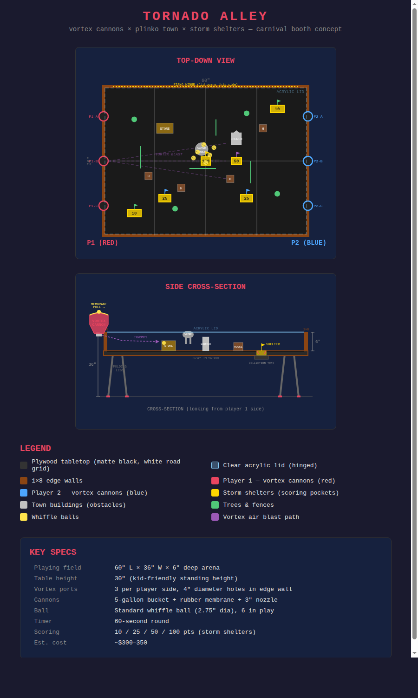 | Entertainment 6 · Memorability 6 · Construction 5 · K-1 5 · 2-3 7 · 4-5 7 · Skill/Luck 5 · Chaos 5 · Durability 6 · Photo 6 · Onboarding 7 |
| **[Stomp Rockets Plinko](./20260317T1200-stomp-rockets-plinko)** — 6.9/10 Kids stomp on air bladders to launch whiffle balls upward into a giant 7ft tilted plinko board mounted above them. The harder and faster you stomp, the higher the ball goes — and the higher-value scoring zones it can reach on the way back down. | 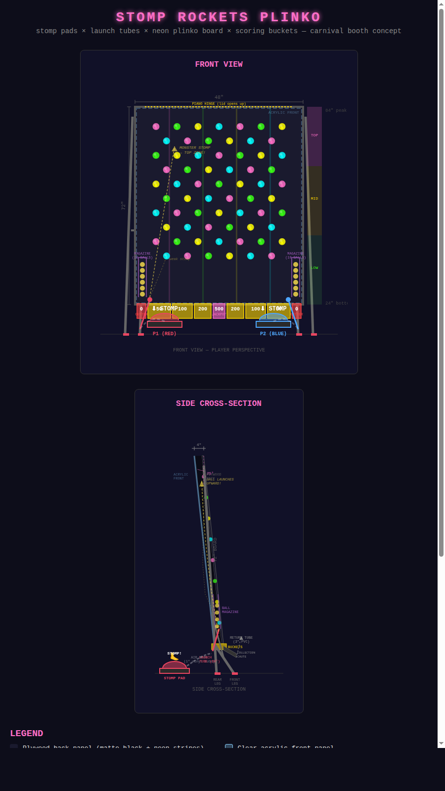 | Entertainment 7 · Memorability 7 · Construction 6 · K-1 6 · 2-3 8 · 4-5 7 · Skill/Luck 7 · Chaos 7 · Durability 7 · Photo 7 · Onboarding 7 |
| **[Flipper Plinko](./20260317T1241-flipper-plinko)** — 6.6/10 Snap-together portable pinball plinko that fits in a sedan. A pegboard peg field with one flipper per player, spring-loaded plunger launch, and PVC frame. 30 lbs, $200, 10-minute setup. | 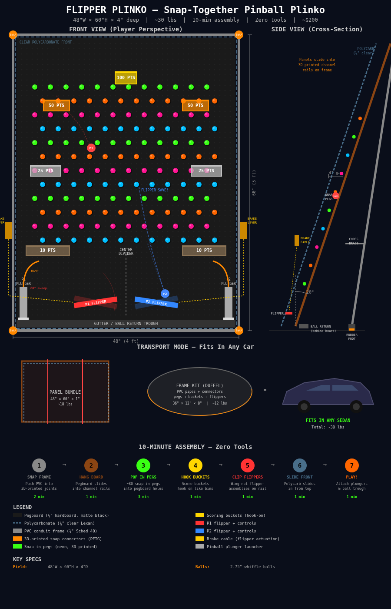 | Entertainment 6 · Memorability 5 · Construction 8 · K-1 6 · 2-3 7 · 4-5 7 · Skill/Luck 7 · Chaos 6 · Durability 7 · Photo 7 · Onboarding 7 |
| **[Buzz Ball](./20260317T1400-buzz-ball)** — 7.1/10 A giant honeycomb-themed plinko board where kids launch balls upward using spring-loaded plungers, then watch them cascade through hexagonal pegs into honey pot scoring buckets. A volunteer behind the board cranks bee bumpers that pop out and send balls ricocheting in wild directions. | 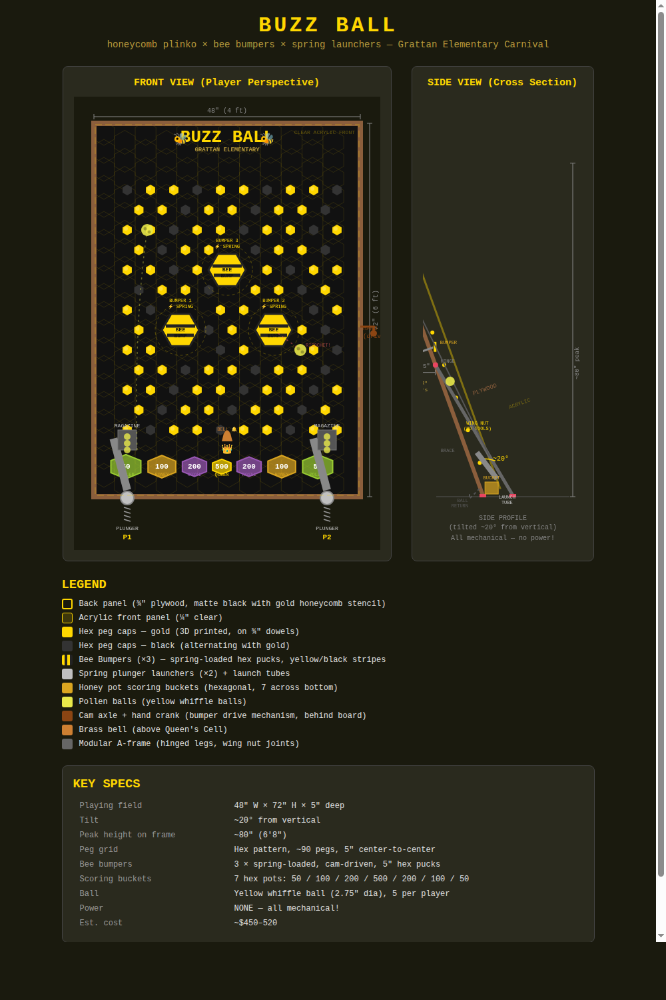 | Entertainment 7 · Memorability 7 · Construction 5 · Appeal 8 · Skill/Luck 8 · Chaos 6 · Durability 7 · Photo 8 · Onboarding 8 |
| **[Pinball Panic](./20260317T1430-pinball-panic)** — 7.5/10 A giant walk-up pinball machine where kids ARE the flippers. 4x8 ft playfield with oversized wooden flippers via door hinges, spring-loaded plunger, bumpers, ramps, and spinning targets. | 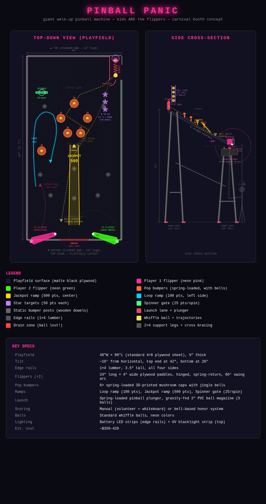 | Entertainment 7 · Memorability 7 · Construction 6 · K-1 5 · 2-3 8 · 4-5 9 · Skill/Luck 8 · Chaos 8 · Durability 7 · Photo 8 · Onboarding 9 |
| **[Earthquake Tilt Plinko](./20260317T1500-earthquake-tilt-plinko)** — 7.0/10 A cooperative full-body plinko game where two players stand on opposite ends of a giant seesaw platform that tilts the entire plinko board. Both players shift their weight together to steer balls into high-value scoring zones. | 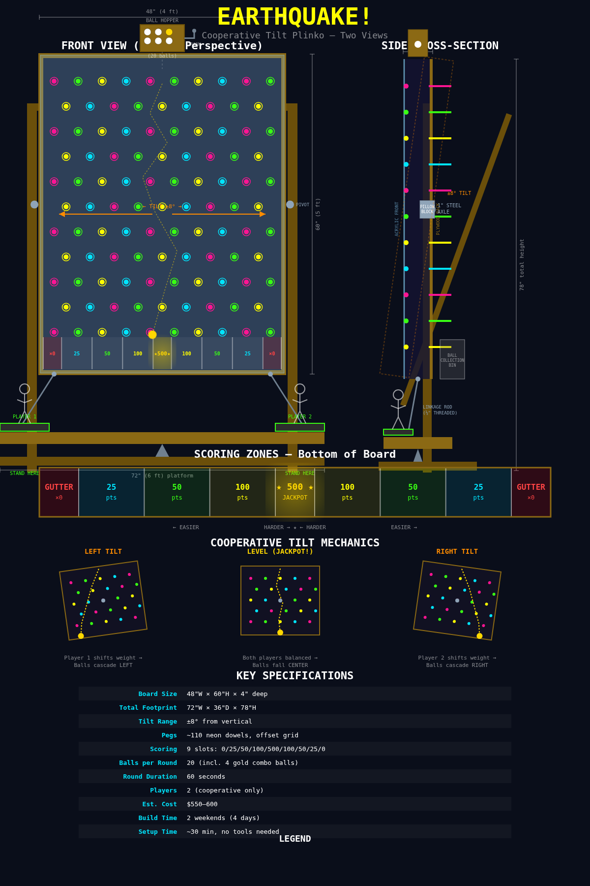 | Entertainment 7 · Memorability 7 · Construction 5 · Appeal 8 · Skill/Luck 7 · Chaos 6 · Durability 8 · Photo 7 · Onboarding 8 |
| **[Mega Pinball Plinko](./20260317T1500-mega-pinball-plinko)** — 7.0/10 A giant real-life pinball machine — 4 ft wide, 6 ft tall, tilted at 20°. Two kids each control one massive mechanical flipper. Spring-loaded plunger launches whiffle balls into a plinko peg field with PVC bumpers, loop-de-loop ramps, and spinning targets. | 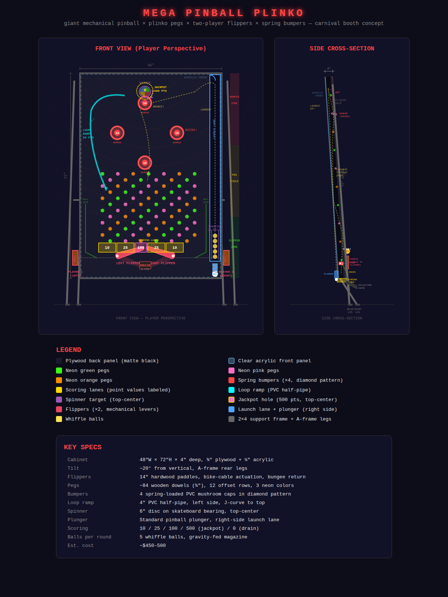 | Entertainment 7 · Memorability 7 · Construction 5 · Appeal 7 · Skill/Luck 8 · Chaos 5 · Durability 8 · Photo 8 · Onboarding 8 |
| **[Popsicle Plinko](./20260317T1500-popsicle-plinko)** — 6.7/10 A carnival-scale plinko board that looks like it was built from giant craft supplies — oversized popsicle sticks, pushpin pegs, rubber band bumpers, clothespin-snap launchers. Every player gets a take-home craft kit to build a mini version at home. | 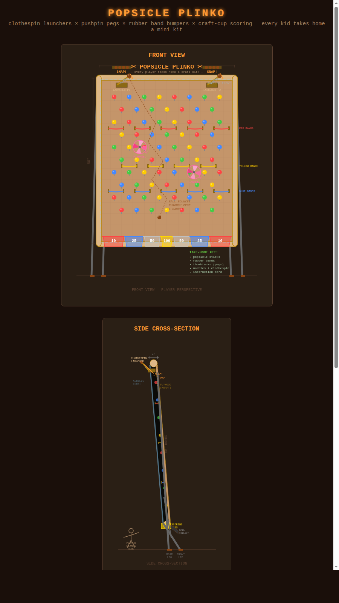 | Entertainment 6 · Memorability 9 · Construction 8 · K-1 9 · 2-3 8 · 4-5 5 · Skill/Luck 3 · Chaos 4 · Durability 9 · Photo 7 · Onboarding 9 |
| **[Slingshot Siege](./20260317T1500-slingshot-siege)** — 7.1/10 Two players face off across a fortress wall — a 5x4 ft vertical plinko board with castle gates at varying heights. Each player wields a swivel-mounted slingshot, launching whiffle balls through the gates to invade the opponent's side. Higher gates are harder but unleash longer cascades worth more points. | 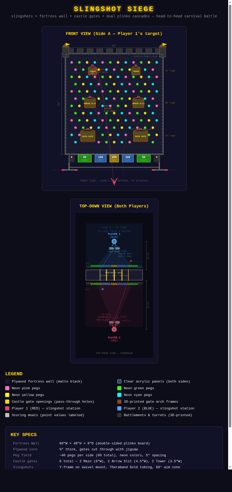 | Entertainment 7 · Memorability 7 · Construction 6 · K-1 6 · 2-3 8 · 4-5 8 · Skill/Luck 6 · Chaos 6 · Durability 8 · Photo 8 · Onboarding 8 |
| **[The Contraption](./20260317T1500-the-contraption)** — 7.0/10 A massive 4x6 ft vertical board where every interaction point is a unique 3D-printed mechanism — spinning wheels, pendulum gates, gear-driven ball lifts, funnel spirals, see-saw catapults, trap doors, and chain-reaction triggers. Two players launch via crank-powered lifts into a Rube Goldberg wonderland. | 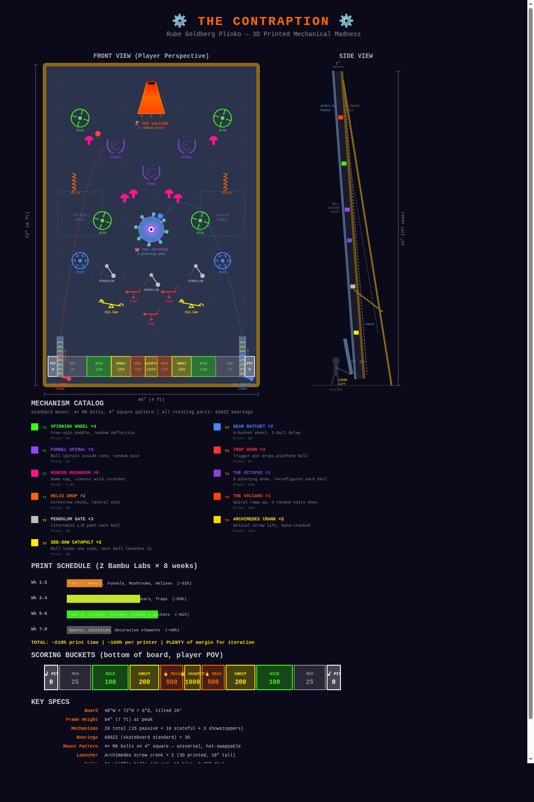 | Entertainment 7 · Memorability 8 · Construction 4 · K-1 7 · 2-3 9 · 4-5 8 · Skill/Luck 5 · Chaos 7 · Durability 6 · Photo 8 · Onboarding 8 |
| **[Thunder Drops](./20260317T1500-thunder-drops)** — 6.9/10 A storm-chaser themed plinko board that assaults every sense. Players crank a catapult to hurl balls into a fog-shrouded, blacklit plinko field where they cascade through wind chimes, LED lightning, and mist jets — landing in candy-dispensing scoring buckets at the bottom. | 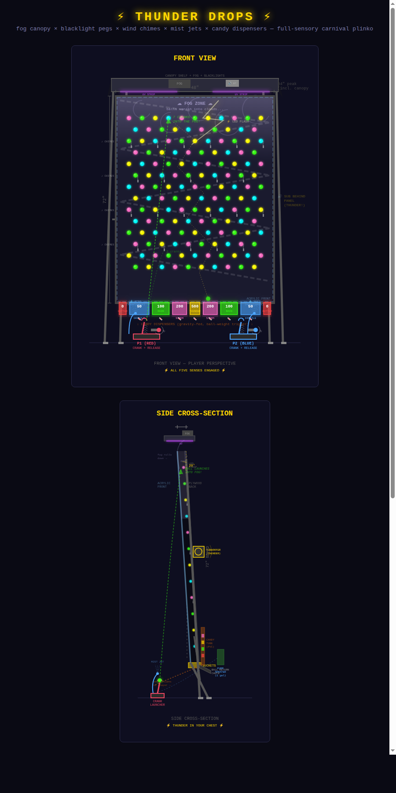 | Entertainment 7 · Memorability 7 · Construction 4 · Appeal 8 · Skill/Luck 8 · Chaos 8 · Durability 5 · Photo 7 · Onboarding 8 |
| **[Wreck-O-Rama](./20260317T1600-wreck-o-rama)** — 7.1/10 Every kid wants to swing a wrecking ball. A single-swing demolition game with a rotating turntable tower of blocks — gold blocks and skull blocks for scoring. Satisfying destruction spectacle, but a critical throughput problem (40 kids/hr due to 60-sec resets). | 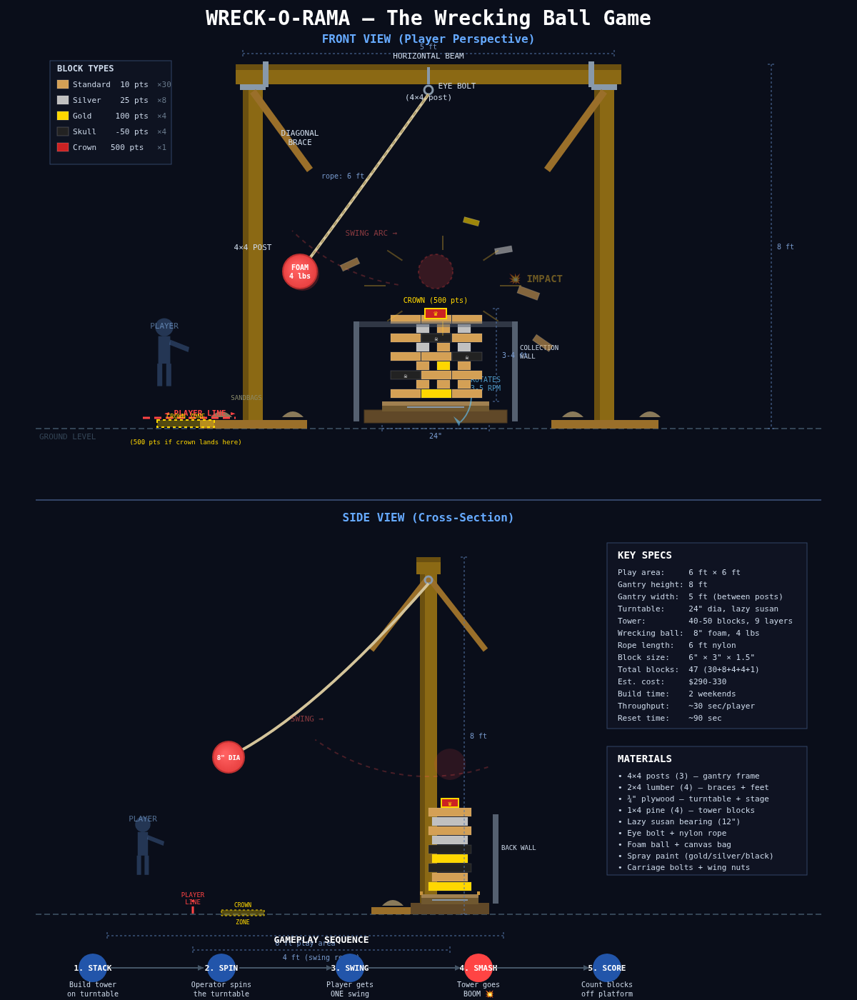 | Entertainment 6 · Memorability 7 · Construction 8 · Appeal 7.3 · Skill/Luck 6 · Chaos 9 · Durability 9 · Photo 7 · Onboarding 8 |
| **[Flipper Frenzy](./20260317T1700-flipper-frenzy)** — 9.2/10 Flipper Plinko evolved into a portable pinball riot. Auto-feeding 6 simultaneous balls, dual flippers per player, spinning windmill pegs with bearings, musical chime pegs, a Warp Zone portal, and a death gap. Still fits in a sedan at 33 lbs. | 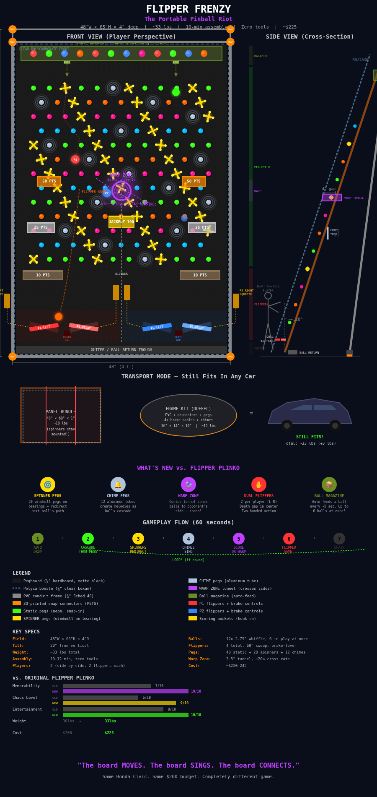 | Entertainment 10 · Memorability 10 · Construction 8 · K-1 9 · 2-3 10 · 4-5 10 · Skill/Luck 8 · Chaos 9 · Durability 8 · Photo 10 · Onboarding 9 |
| **[M18 Cyclone Plinko](./20260317T1700-m18-cyclone-plinko)** — 7.0/10 A massive plinko board where players wield actual Milwaukee M18 blowers as their controllers. Drop a ball from the top, then blast it with 120 MPH of air through side-mounted ports to steer it toward high-scoring zones. The Milwaukee tools ARE the game. | 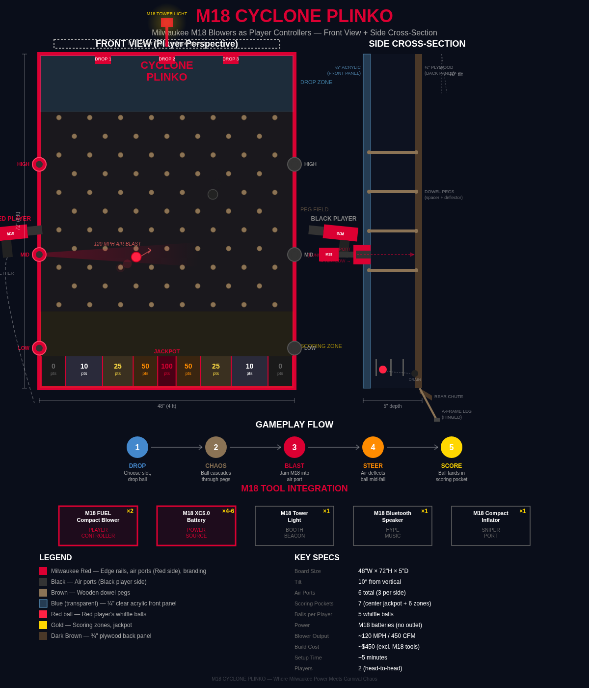 | Entertainment 7 · Memorability 7 · Safety 4 · Construction 6 · Appeal 7 · Skill/Luck 7 · Chaos 9 · Durability 7 · Photo 8 · Onboarding 8 |
| **[The Swarm](./20260317T1700-the-swarm)** — 7.1/10 Two players stomp on giant 3D-printed flower pads to launch pollen balls into a 4x6 ft honeycomb plinko field. Balls ricochet off spinning drone bee wheels, get swallowed by a central Queen Bee Spinner, and cascade into honey pot scoring buckets that dispense honey sticks. | 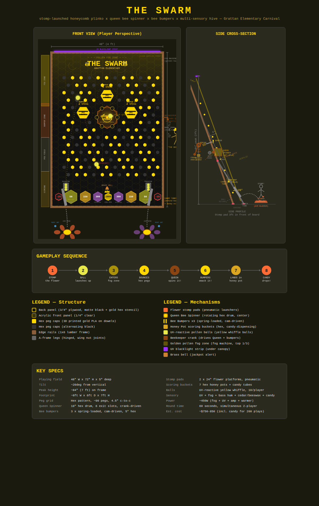 | Entertainment 8 · Memorability 8 · Construction 4 · Appeal 8 · Skill/Luck 7 · Chaos 8 · Durability 6 · Photo 7 · Onboarding 8 |
| **[Blower Duel Plinko](./20260317T1800-blower-duel-plinko)** — 9.0/10 Two players, two M18 blowers, one open-air plinko board between them. Aim your blower at the board to score — or aim it at your opponent's face to sabotage their turn. Every blast is a choice: help yourself or wreck your enemy. | 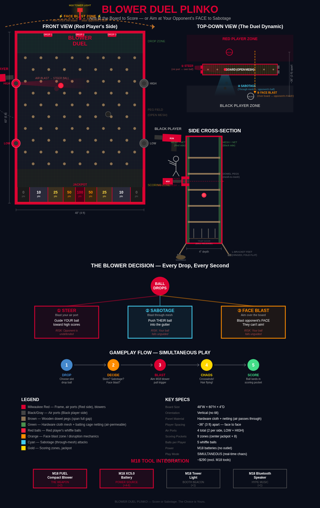 | Entertainment 9.5 · Memorability 10 · Construction 7.5 · K-1 7 · 2-3 9 · 4-5 10 · 6+ 8 · Skill/Luck 7S/3L · Chaos 9 · Durability 8.5 · Photo 9.5 · Onboarding 8 |
| **[The Great Crank Derby](./20260317T1900-crank-racer-derby)** — 6.9/10 Zero plinko DNA. Two players grab hand cranks and furiously wind their wooden race cars up a 7-foot vertical track through S-curves and chicanes. First car to smack the bell at the top wins. Pure kid energy converted into speed through gears, string, and pulleys. | 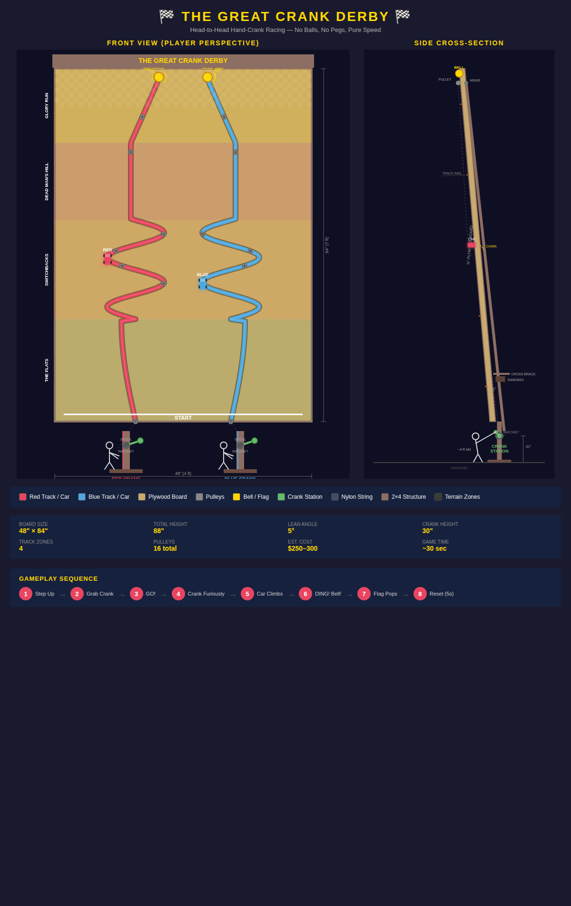 | Entertainment 7 · Memorability 7 · Construction 6 · K-1 5 · 2-3 7 · 4-5 8 · Skill/Luck 9 · Chaos 3 · Durability 8 · Photo 6 · Onboarding 10 |
| **[Drop Zone Express](./20260317T1900-drop-zone-express)** — 6.2/10 Operations-first plinko with 3 simultaneous players, auto-return ball system, and one-piece board design. Pull a handle, drop a ball, watch the cascade. Throughput machine (430 kids/hr) but pure luck gameplay with minimal player engagement. | 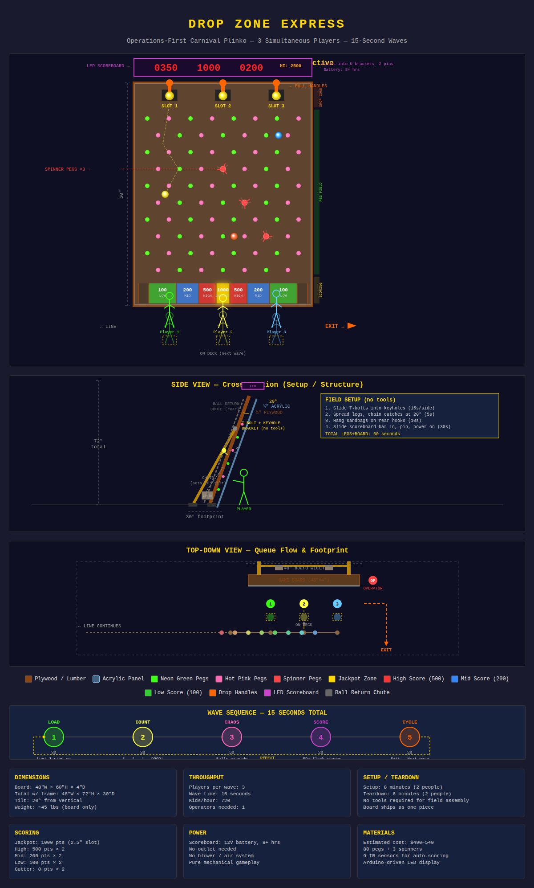 | Entertainment 5 · Memorability 5 · Construction 8 · Appeal 6 · Skill/Luck 2 · Chaos 7 · Durability 9 · Photo 5 · Onboarding 9 |
| **[Mega Drop Live](./20260317T1900-mega-drop-live)** — 6.3/10 A plinko board that thinks it's a live game show broadcast. Raspberry Pi + OpenCV ball tracking + MediaPipe pose detection creates a TV broadcast experience with real-time tracking, pose-activated power-ups, AI play-by-play announcer, instant replays, and a daily leaderboard. | 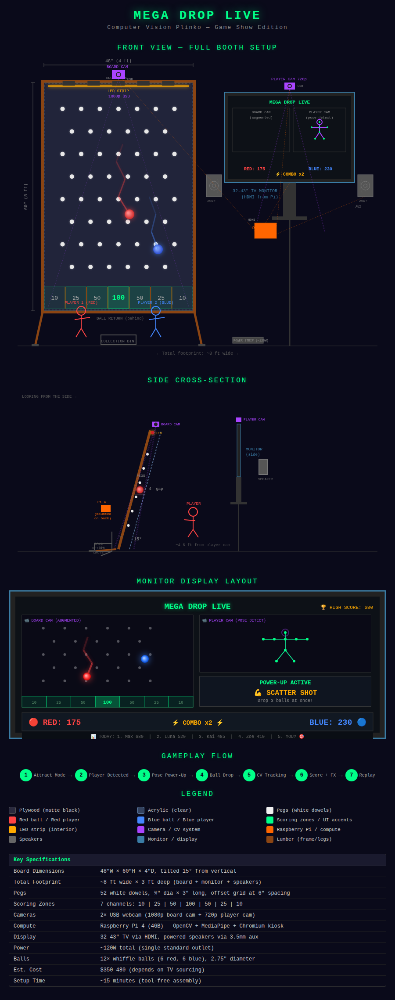 | Entertainment 7 · Memorability 7 · Construction 5 · K-1 6 · 2-3 8 · 4-5 7 · Skill/Luck 4 · Chaos 5 · Durability 8 · Photo 7 · Onboarding 8 |
